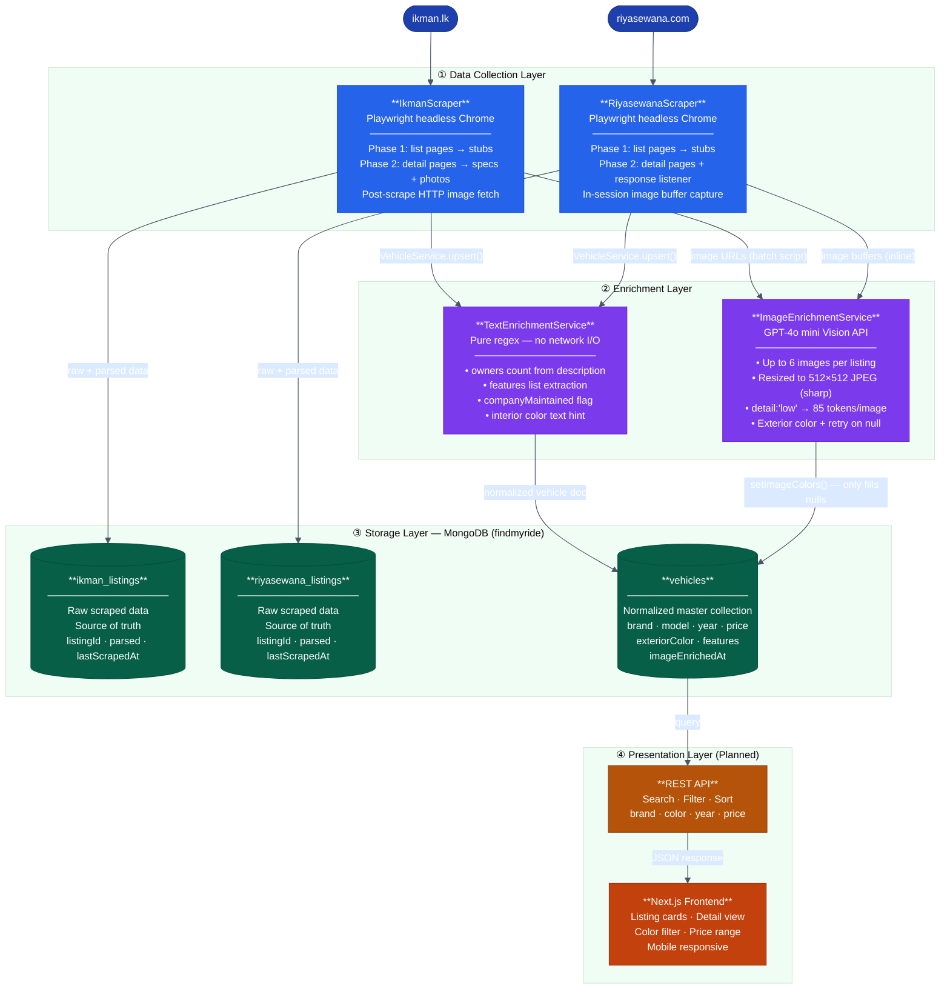
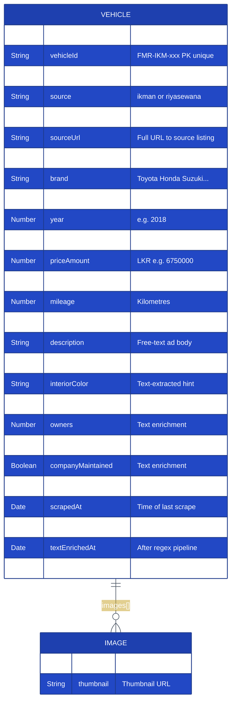
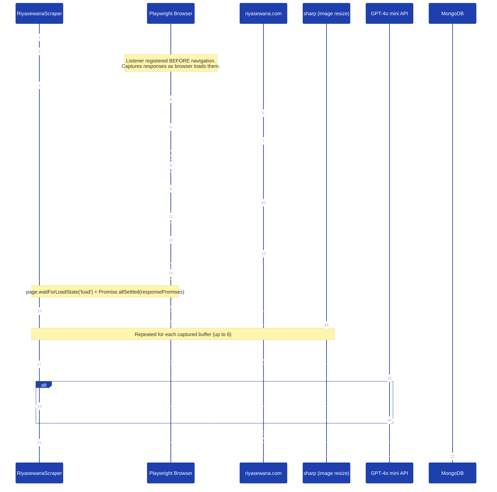

# FindMyRide — Architecture Diagrams (Mermaid)

> **How to render:** Paste any code block at [mermaid.live](https://mermaid.live) → Export PNG or SVG.
> Also renders natively in GitHub README, Notion, GitLab, and VS Code (Markdown Preview Mermaid Support extension).

---

## Figure 3.1 — High-Level System Architecture

---

## Figure 3.3 — Vehicle Document Schema

---

## Figure 3.5 — Two-Phase Scraping Flowchart

```mermaid
%%{init: {'theme': 'base', 'themeVariables': {
  'primaryColor': '#2563eb',
  'primaryTextColor': '#ffffff',
  'primaryBorderColor': '#1d4ed8',
  'lineColor': '#374151',
  'secondaryColor': '#eff6ff',
  'tertiaryColor': '#f0fdf4',
  'fontSize': '13px'
}}}%%
flowchart TD
  START([" Scraper.run&#40;&#41; starts<br/>runStart = new Date&#40;&#41; "])
  START --> CATS["Load category list from scraper config<br/><i>e.g. cars · suvs · vans · cabs</i>"]
  CATS --> P1

  subgraph P1 ["  Phase 1 — List Pages  "]
    direction TB
    FETCH_LIST["Navigate to list page URL<br/>openPage&#40;url&#41; with retry"]
    FETCH_LIST --> EXTRACT_LIST["Extract listing cards from DOM<br/>listingId · title · price · location · thumbnail"]
    EXTRACT_LIST --> NEXT_P{hasNextPage?}
    NEXT_P -->|"Yes — pageNum++"| FETCH_LIST
    NEXT_P -->|No| STUBS_DONE
    STUBS_DONE(["stubs&#91;&#93; collected"])
  end

  STUBS_DONE --> P2

  subgraph P2 ["  Phase 2 — Detail Pages  "]
    direction TB
    POOL["Concurrency pool<br/>N stubs processed in parallel"]
    POOL --> CACHED{Already in DB<br/>AND age &lt; 24h?}

    CACHED -->|Yes| SKIP_DETAIL["Use cached data<br/>skip detail fetch"]

    CACHED -->|No| OPEN["Open detail page<br/>context.newPage&#40;&#41;"]
    OPEN --> LISTEN["Register response listener<br/><b>BEFORE</b> navigation<br/>page.on&#40;'response', handler&#41;"]
    LISTEN --> GOTO["page.goto&#40;detailUrl&#41;<br/>Browser loads page + fires all requests"]
    GOTO --> DRAIN["await Promise.allSettled&#40;responsePromises&#41;<br/>Drain all in-flight image body reads"]
    DRAIN --> EXTRACT_DOM["Extract DOM specs<br/>brand · model · year · price · photos"]

    SKIP_DETAIL --> UPSERT
    EXTRACT_DOM --> UPSERT["VehicleService.upsert&#40;&#41;<br/>TextEnrichmentService runs inline<br/>Write normalized doc to vehicles"]

    UPSERT --> HAS_IMGS{imageBuffers.length &gt; 0?}
    HAS_IMGS -->|No| CHUNK_DONE
    HAS_IMGS -->|Yes| GPT["enrichFromBuffers&#40;&#41;<br/>Resize 512×512 → base64<br/>GPT-4o mini API call"]
    GPT --> RETRY{Color returned?}
    RETRY -->|Yes| SET_COL["setImageColors&#40;&#41;<br/>MongoDB $cond — only fill null fields"]
    RETRY -->|"No — retry once with<br/>simplified prompt"| GPT2["GPT-4o mini retry call"]
    GPT2 --> SET_COL2["setImageColors&#40;&#41;<br/>or store null"]
    SET_COL --> CHUNK_DONE
    SET_COL2 --> CHUNK_DONE(["Chunk complete"])
  end

  CHUNK_DONE --> MORE{More stubs?}
  MORE -->|Yes| POOL
  MORE -->|No| DEACT["Mark stale listings isActive=false<br/>lastScrapedAt &lt; runStart"]
  DEACT --> DONE([" Done — log stats<br/>new · updated · deactivated · errors "])
```

---

## Figure 3.7 — Riyasewana Response Interception Flow

---

## Figure 3.8 — GPT-4o mini Color Classification (API Detail)

```mermaid
%%{init: {'theme': 'base', 'themeVariables': {
  'primaryColor': '#7c3aed',
  'primaryTextColor': '#ffffff',
  'primaryBorderColor': '#6d28d9',
  'lineColor': '#4b5563',
  'fontSize': '13px'
}}}%%
flowchart LR
  subgraph INPUT ["  Input — classifyWithGPT&#40;base64Images, isRetry&#41;  "]
    direction TB
    I1["System prompt<br/>─────────────<br/>Role: Sri Lankan car color detector<br/>Instructions: find exterior body panels<br/>Ignore: license plates, glass, rims<br/>Valid colors: White Silver Grey Black<br/>Red Maroon Blue Dark Blue Light Blue<br/>Green Dark Green Orange Yellow Gold<br/>Beige Brown Purple"]
    I2["User message<br/>─────────────<br/>Up to 6 × image_url content blocks<br/>url: data:image/jpeg;base64,...<br/>detail: 'low'  ←  85 tokens each<br/>─────────────<br/>Text: Identify the body paint color.<br/>Return JSON only."]
    I3["Model params<br/>─────────────<br/>model: gpt-4o-mini<br/>temperature: 0<br/>max_tokens: 50<br/>response_format: json_object"]
  end

  subgraph API ["  OpenAI API  "]
    CALL["POST /v1/chat/completions"]
  end

  subgraph OUTPUT ["  Output handling  "]
    direction TB
    PARSE["Parse JSON<br/>response.choices&#91;0&#93;.message.content"]
    CHECK{exteriorColor<br/>is null or<br/>'Unknown'?}
    COLOR["Return color string<br/>e.g. 'Blue'"]
    RETRY["Retry with<br/>RETRY_SYSTEM_PROMPT<br/>simpler language"]
    NULL["Return null<br/>stored in DB as null"]

    PARSE --> CHECK
    CHECK -->|No| COLOR
    CHECK -->|"Yes (1st attempt)"| RETRY
    RETRY -->|"Color found"| COLOR
    RETRY -->|"Still null"| NULL
  end

  subgraph COST ["  Token cost estimate  "]
    direction TB
    C1["6 images × 85 tokens  =  510"]
    C2["System prompt         ≈  200"]
    C3["User text             ≈   30"]
    C4["Response              ≈   15"]
    C5["─────────────────────────────"]
    C6["Total ≈ 755 tokens per vehicle"]
    C7["Cost  ≈ $0.00012 per vehicle"]
    C1 --- C2 --- C3 --- C4 --- C5 --- C6 --- C7
  end

  INPUT --> API --> OUTPUT
```

---

## Figure 3.10 — Data Normalisation: Two Sources → One Collection

```mermaid
%%{init: {'theme': 'base', 'themeVariables': {
  'primaryColor': '#065f46',
  'primaryTextColor': '#ffffff',
  'primaryBorderColor': '#064e3b',
  'lineColor': '#4b5563',
  'secondaryColor': '#ecfdf5',
  'fontSize': '13px'
}}}%%
flowchart LR
  classDef raw      fill:#1e40af,stroke:#1e3a8a,color:#fff
  classDef service  fill:#7c3aed,stroke:#6d28d9,color:#fff
  classDef output   fill:#065f46,stroke:#064e3b,color:#fff
  classDef note     fill:#fef9c3,stroke:#ca8a04,color:#1c1917,font-size:12px

  subgraph IK ["ikman_listings"]
    IK_DOC["listingId: 7263810<br/>─────────────<br/>brand: Toyota<br/>model: Aqua<br/>year: 2018<br/>body: Sedan<br/>color: Silver<br/>fuel type: Hybrid<br/>gear: Auto<br/>mileage: 62000 km<br/>engine: 1500 cc<br/>price: Rs 6,750,000<br/>Variant: G Grade"]:::raw
  end

  subgraph RY ["riyasewana_listings"]
    RY_DOC["listingId: 11237560<br/>─────────────<br/>make: Toyota<br/>model: Aqua<br/>yom: 2018<br/><i>(no body type field)</i><br/><i>(no color field)</i><br/>fuel type: Hybrid<br/>gear: Auto<br/>mileage (km): 62000<br/>engine (cc): 1500<br/>price: Rs.6,850,000<br/><i>(no variant/grade)</i>"]:::raw
  end

  subgraph SVC ["VehicleService + Parsers"]
    direction TB
    P1["parseDetailPage&#40;&#41;<br/>─────────────<br/>Rename: brand←make, year←yom<br/>engineCC←engine&#40;cc&#41;<br/>photos←images"]:::service
    P2["normaliseCategory&#40;&#41;<br/>─────────────<br/>body='Sedan' → 'Car'<br/>category slug='cars' → 'Car'"]:::service
    P3["normaliseColor&#40;&#41;<br/>─────────────<br/>ikman: 'Pearl White'→'White'<br/>riyasewana: null → GPT fills"]:::service
    P4["generateVehicleId&#40;&#41;<br/>─────────────<br/>FMR-IKM-7263810<br/>FMR-RIY-11237560"]:::service
    P1 --- P2 --- P3 --- P4
  end

  subgraph OUT ["vehicles (normalized)"]
    VH_DOC["vehicleId: FMR-IKM-7263810<br/>─────────────<br/>brand: Toyota<br/>model: Aqua<br/>year: 2018<br/>category: Car<br/>engineCapacity: 1500<br/>mileage: 62000<br/>exteriorColor: Silver<br/>limitedEditionName: G Grade<br/>price.amount: 6750000<br/>isActive: true"]:::output
  end

  NOTE_IK["ikman has color spec<br/>→ scraped directly"]:::note
  NOTE_RY["riyasewana has no color<br/>→ GPT-4o mini fills it"]:::note

  IK_DOC --> SVC
  RY_DOC --> SVC
  SVC --> VH_DOC
  IK_DOC -.-> NOTE_IK
  RY_DOC -.-> NOTE_RY
```

---

## Figure 3.6 — Ikman List Page → Detail Page → Parsed Output

```mermaid
%%{init: {'theme': 'base', 'themeVariables': {
  'primaryColor': '#b45309',
  'primaryTextColor': '#ffffff',
  'primaryBorderColor': '#92400e',
  'lineColor': '#4b5563',
  'fontSize': '13px'
}}}%%
flowchart LR
  classDef dom      fill:#1e40af,stroke:#1e3a8a,color:#fff
  classDef parser   fill:#7c3aed,stroke:#6d28d9,color:#fff
  classDef output   fill:#065f46,stroke:#064e3b,color:#fff

  subgraph LIST ["List Page DOM"]
    L1["&lt;li.item&gt;<br/>─────────────<br/>h2.more a → title + URL<br/>.imgbox img → thumbnail<br/>.boxintxt.b → price<br/>.boxintxt (first) → location<br/>.boxintxt (km) → mileage<br/>.boxintxt.s → posted date"]:::dom
  end

  subgraph DETAIL ["Detail Page DOM"]
    D1["ad.specs{} object<br/>─────────────<br/>brand, model, year<br/>body, color, fuel type<br/>gear, mileage, engine cc<br/>price, variant<br/>─────────────<br/>ad.images.meta&#91;&#93;<br/>src + alt = full/thumb URLs"]:::dom
  end

  subgraph PARSERS ["Parsers"]
    PL["parseListPage&#40;&#41;<br/>─────────────<br/>parsePrice&#40;raw&#41;<br/>parseMileage&#40;raw&#41;<br/>parsePostedAt&#40;raw&#41;"]:::parser
    PD["parseDetailPage&#40;&#41;<br/>─────────────<br/>parseYear&#40;yom&#41;<br/>parseEngineCC&#40;engine&#41;<br/>normaliseCategory&#40;body&#41;<br/>parsePhotos&#40;images, slug&#41;"]:::parser
  end

  subgraph STUB ["Stub Object"]
    S1["listingId, sourceUrl<br/>title, price{amount, isNeg}<br/>mileage, location{city}<br/>thumbnail, postedAt"]:::output
  end

  subgraph PARSED ["Parsed Object"]
    P1["+ brand, model, year<br/>+ category: 'Car'<br/>+ color: 'Silver'<br/>+ engineCC: 1500<br/>+ limitedEditionName: 'G Grade'<br/>+ photos: &#91;{url, thumbnail}&#93;<br/>+ description"]:::output
  end

  LIST --> PL --> STUB
  DETAIL --> PD
  STUB --> PD --> PARSED
  PARSED -->|"VehicleService.upsert&#40;&#41;"| DB[("vehicles")]:::output
```

---

## Rendering Instructions

| Tool | How |
|------|-----|
| **mermaid.live** | Paste any code block → click Export → PNG or SVG |
| **GitHub** | Push this `.md` file — diagrams render automatically in the viewer |
| **VS Code** | Install "Markdown Preview Mermaid Support" extension → open preview |
| **Notion** | Type `/code` → set language to `mermaid` → paste block |
| **Word/PDF** | Export PNG from mermaid.live → Insert → Picture |

All diagrams use the `base` theme which exports cleanly on white backgrounds.
For dark-background slides, change `'theme': 'dark'` in the `%%{init}%%` header.
